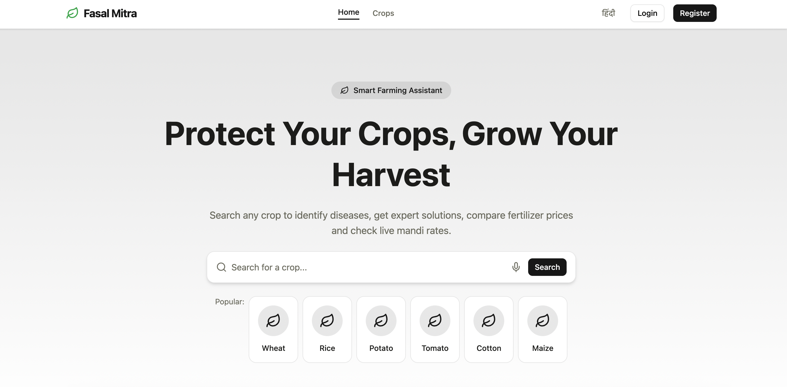

# 🌱 Fasal Mitra (फसल मित्र)

> A smart agriculture assistant for Indian farmers - identify crop diseases, get expert solutions, compare fertilizer prices, and check live mandi rates.

---

## 🚀 Live Demo
https://fasal-mitra.vercel.app

---

## 📸 Screenshots


---

## 🧰 Tech Stack

### Frontend
| Technology | Purpose |
|---|---|
| React 18 + TypeScript | UI framework |
| Vite | Build tool |
| Tailwind CSS v4 | Styling |
| Shadcn/UI | Component library |
| React Router v6 | Client-side routing |
| i18next | Multilingual (English + Hindi) |
| Axios | API communication |

### Backend
| Technology | Purpose |
|---|---|
| Node.js + Express | REST API server |
| TypeScript | Type safety |
| MongoDB + Mongoose | Database |
| JWT (Access + Refresh) | Authentication |
| bcryptjs | Password hashing |
| Cookie-parser | HTTP-only cookie management |

### External APIs
| API | Purpose |
|---|---|
| OpenWeatherMap | Local weather + irrigation alerts |
| Data.gov.in | Live mandi (market) prices |
| Razorpay  | Payment gateway |

---

## ✅ Features Built

### Phase 1 — Foundation
- [x] Vite + React + TypeScript project setup
- [x] Tailwind CSS v4 with custom agriculture color palette
- [x] Shadcn/UI component library configured
- [x] MongoDB Atlas connected with Mongoose
- [x] All 6 schemas: User, Crop, Disease, Product, Listing, Order
- [x] Multilingual support — English and Hindi (i18next)
- [x] React Router with full page structure
- [x] Responsive Navbar with language toggle (mobile + desktop)
- [x] Footer with quick links

### Phase 2 — Core Features
- [x] Home page with hero section and search bar
- [x] Live search with dropdown (searches DB in real time)
- [x] Voice search using Web Speech API
- [x] Crop Detail page (season, irrigation, soil type, diseases grid)
- [x] Disease Detail page (symptoms, prevention, recommended products)
- [x] JWT Authentication — Register and Login
- [x] Access token (15min) + Refresh token (7 days) with HTTP-only cookies
- [x] Axios interceptor for automatic silent token refresh
- [x] Auth Context with global user state
- [x] Protected Routes (redirect to login if not authenticated)
- [x] Save crops feature (toggle save/unsave per user)
- [x] Search history tracking per user
- [x] User Profile page

### Phase 3 — Live Data
- [x] Weather widget with local temperature, humidity, wind speed
- [x] Irrigation alerts based on humidity levels
- [x] Live Mandi prices from Data.gov.in API
- [x] Scrollable mandi price table with refresh

### Coming Soon
- [x] AI image diagnosis (TensorFlow.js / Hugging Face)
- [x] E-commerce listings with price comparison
- [x] Razorpay payment integration
- [x] Real-time expert chat (Socket.io)
- [x] Deployment (Vercel + Render)

---

## 🗂️ Project Structure

```
agri-app/
├── client/                      # React frontend
│   ├── src/
│   │   ├── assets/              # Images, icons
│   │   ├── components/
│   │   │   ├── common/          # Navbar, Footer, WeatherWidget, MandiPrices
│   │   │   └── ui/              # Shadcn base components
│   │   ├── context/             # AuthContext
│   │   ├── hooks/               # Custom React hooks
│   │   ├── locales/             # en.json, hi.json
│   │   ├── pages/               # Home, CropDetail, DiseaseDetail, Login, Register, Profile
│   │   ├── services/            # api.ts, cropService, diseaseService, weatherService, mandiService
│   │   ├── types/               # TypeScript types
│   │   └── utils/               # Helper functions
│   └── .env                     # Frontend env variables
│
├── server/                      # Express backend
│   ├── src/
│   │   ├── controllers/         # authController, cropController, diseaseController
│   │   ├── middleware/          # authMiddleware
│   │   ├── models/              # User, Crop, Disease, Product, Listing, Order
│   │   ├── routes/              # authRoutes, cropRoutes, diseaseRoutes
│   │   ├── services/            # Third-party integrations
│   │   └── utils/               # generateTokens, seed
│   └── .env                     # Backend env variables
│
└── README.md
```

---

## ⚙️ Local Setup

### Prerequisites
- Node.js v18+
- MongoDB Atlas account
- OpenWeatherMap API key
- Data.gov.in API key

### 1. Clone the repo
```bash
git clone https://github.com/Deepak-Patidar-a/fasal-mitra.git
cd fasal-mitra
```

### 2. Setup Backend
```bash
cd server
npm install
```

Create `server/.env`:
```
PORT=8000
MONGODB_URI=your_mongodb_atlas_uri
JWT_ACCESS_SECRET=your_access_secret
JWT_REFRESH_SECRET=your_refresh_secret
```

Run the server:
```bash
npm run dev
```

### 3. Setup Frontend
```bash
cd client
npm install
```

Create `client/.env`:
```
VITE_WEATHER_API_KEY=your_openweathermap_key
VITE_MANDI_API_KEY=your_datagov_key
```

Run the frontend:
```bash
npm run dev
```

### 4. Seed the database
```bash
cd server
npx ts-node src/utils/seed.ts
```

### 5. Open in browser
```
http://localhost:5173
```

---

## 🌐 API Endpoints

### Auth
| Method | Endpoint | Description |
|---|---|---|
| POST | `/api/auth/register` | Register new user |
| POST | `/api/auth/login` | Login |
| POST | `/api/auth/logout` | Logout |
| POST | `/api/auth/refresh` | Refresh access token |
| GET | `/api/auth/me` | Get current user |
| POST | `/api/auth/save-crop` | Toggle save crop |
| POST | `/api/auth/search-history` | Add to search history |
| GET | `/api/auth/saved-crops` | Get saved crops |

### Crops
| Method | Endpoint | Description |
|---|---|---|
| GET | `/api/crops` | Get all crops |
| GET | `/api/crops/:slug` | Get crop by slug |
| GET | `/api/crops/search?q=` | Search crops |

### Diseases
| Method | Endpoint | Description |
|---|---|---|
| GET | `/api/diseases` | Get all diseases |
| GET | `/api/diseases/:slug` | Get disease by slug |

---

## 🎨 Color Palette

| Name | Hex | Usage |
|---|---|---|
| Primary Green | `#4A7C59` | Main brand color |
| Primary Light | `#8DB87A` | Hover states |
| Background | `#F7F5F0` | Page background |
| Surface | `#FFFFFF` | Cards, navbar |
| Border | `#E8E4DC` | Dividers |
| Accent Brown | `#8B6914` | Headings |
| Text Primary | `#1C1C1A` | Main text |
| Text Secondary | `#6B6B5E` | Muted text |
| Success | `#3A7D44` | Healthy indicators |
| Warning | `#D4890A` | Alerts |
| Error | `#C0392B` | Disease alerts |

---

## 👨‍💻 Author

**Deepak Patidar**
- GitHub: [@Deepak-Patidar-a](https://github.com/Deepak-Patidar-a)

---

## 📄 License

This project is for personal and educational use.

---

_Made with ❤️ for Indian Farmers_